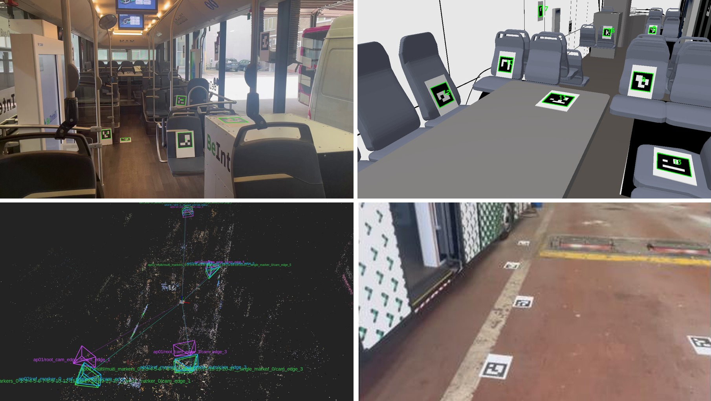

# rigcal — Camera Rig Calibration

<p align="center">
  <strong>Extrinsic calibration of distributed static camera rigs using one moving calibration camera.</strong><br/>
  Simulation and real-world workflows · AP01 / AP02 / AP03 · reproducible results and RViz inspection
</p>

<p align="center">
  
</p>

<p align="center">
  <sub>Real-world bus interior · reviewed bus simulation · RViz result visualization · real-world bus exterior</sub>
</p>

`rigcal` is a reproducible university project for estimating the **extrinsic calibration** of a distributed static camera rig. A moving calibration camera is carried through the scene and creates geometric links between static cameras that may have little or no direct field-of-view overlap.

The project was developed in the context of the **Technische Universität Berlin** module **Application of Robotics and Autonomous Systems**. It provides one workflow for simulation, real recordings, three calibration approaches, diagnostics, publication of scientific artifacts, cross-method comparison, and RViz visualization.

> **Paper/report:** work in progress. See the [paper placeholder](docs/paper/README.md). The repository is the software artifact; the manuscript is not yet a finished publication.

## Quick start

### 1. Install

Python **3.10–3.13** is supported.

```bash
python3 -m pip install -e ".[scientific,standalone]"
```

Start the application with:

```bash
rigcal
```

or from a source checkout:

```bash
python -m camera_rig_calibration
```

The `standalone` extra provides the OpenCV ArUco runtime outside a ROS environment. Depending on the selected workflow, external tools such as **COLMAP**, **FFmpeg/ffprobe**, **ROS 2 / Gazebo**, and **RViz 2** may also be required. Run **Check installation** from the main menu before a long experiment.

For development:

```bash
python3 -m pip install -e ".[scientific,standalone,dev]"
python3 -m compileall -q src tests
pytest -q
```

### 2. Main menu

```text
1. Start a new calibration
2. View results
3. Manage incomplete runs
4. Check installation
5. Cleanup storage
6. Manage intrinsics profiles
0. Exit
```

For normal use, the Wizard is the recommended entry point. Saved queue/configuration files can also be validated or executed non-interactively:

```bash
rigcal --config workspace/<dataset>/queue/queue.yaml --dry-run
rigcal --config workspace/<dataset>/queue/queue.yaml --yes
```

## What is estimated?

The goal is the **6-DoF extrinsic pose** of every static camera: its translation and rotation relative to a shared reference frame.

The moving camera does not become part of the final static rig. Instead, its observations and trajectory provide intermediate geometric connections between viewpoints. Depending on the selected method, those connections are obtained from fiducial markers, an observation graph with bundle adjustment, or a joint Structure-from-Motion reconstruction.

Camera intrinsics are treated separately and remain fixed during the extrinsic-calibration run. In simulation, known Ground Truth is used **only after calibration for evaluation**. It is never used to influence the calibration itself.

## Two typical workflows

### A. Simulation

The stable simulation path uses the reviewed bus Gazebo world and validated moving-camera routes.

```text
rigcal
  → Start a new calibration
  → Simulation
  → choose/derive an experiment
  → add AP01, AP02 and/or AP03
  → review settings
  → run
  → View results
```

A baseline run can be executed without changing advanced settings. For controlled experiments, the Wizard can derive variants that change parameters such as:

- moving-camera route;
- frame density / capture sampling;
- image resolution;
- field of view;
- lighting;
- motion blur;
- capture parameters.

Route, density, resolution, FOV and blur affect the moving camera; lighting affects the world. Capture and shared ArUco observation generation are performed once per simulation experiment and reused by its queued method variants.

The reviewed Route-1/Route-2 assets and validated local routes are discovered automatically. Local route files live below `data_local/simulation_routes/`.

### B. Real-world data

For a real acquisition, create one experiment directory below `data_local/`:

```text
data_local/<experiment_name>/
```

`rigcal` scans the experiment recursively, so exact filenames and nesting are flexible. Recommended role folders are:

```text
static/
moving_frames/
camera_info/
intrinsics/
checkerboard/
```

Typical inputs include:

- static-camera images or videos;
- a moving-camera video or extracted frames;
- camera-info JSON/YAML files;
- a checkerboard video or checkerboard image folder;
- a ROS bag (`.mcap` or `.db3`).

Then:

```text
copy data into data_local/<experiment_name>/
  → rigcal
  → Start a new calibration
  → Real data
  → confirm detected input roles and intrinsics
  → choose AP01/AP02/AP03
  → run
  → View results
```

Moving-camera frames and moving-camera intrinsics are independent selections. Reusable managed intrinsics profiles live below `config/intrinsics/`. See [`data_local/README.md`](data_local/README.md) for a practical input example.

## Calibration methods

The Wizard exposes three reviewed approaches. They solve the same final problem but use different geometric evidence.

### AP01 — Direct / Relay marker-based calibration

AP01 combines synchronized static-camera marker observations with the moving-camera sequence.

When a static camera shares suitable marker support with the selected root camera, AP01 can estimate a **Direct** relationship. Cameras without sufficient direct support can be connected through the moving-camera trajectory using **Relay** transformations.

This makes AP01 comparatively easy to inspect: the result can be traced through explicit marker-supported transformation chains. Useful advanced controls include the root camera, Direct target, observation-quality settings, and optional robust-consensus behavior.

### AP02 — Graph initialization + bundle adjustment

AP02 represents static cameras, moving frames, and fiducial markers as an **observation graph**. It initializes the observable geometry from a reference marker and then refines it with bundle adjustment.

The graph is also an observability diagnostic: disconnected components cannot support a unique cross-component transform. AP02 therefore exposes partial/disconnected geometry instead of silently inventing unsupported rig poses.

The **Combined** bundle-adjustment result is the primary AP02 result; the static-only stage remains available as a diagnostic. Advanced controls include reference-marker selection, frame budgets, initialization strategy, reprojection model, solver budget, robust loss, and observation-quality overrides.

### AP03 — SfM / multi-camera calibration

AP03 jointly registers one image per static camera together with the moving-camera frames in **COLMAP** using natural image features. The SfM reconstruction is initially defined only up to scale; detected markers with known physical size are then used to recover and validate metric scale.

The **Multi-marker** result is the primary AP03 result. The Single-marker variant remains a shared diagnostic. Advanced controls include matcher strategy, compute mode, mapper support, feature-limit policy, marker/scale selection, reprojection thresholds, and scale RANSAC settings.

## Common comparison and evaluation anchor

Each method may use its own internal reference choices, but published cross-method results are expressed on one **common evaluation anchor** selected and frozen during preflight.

This anchor is intentionally independent of AP02's internal reference marker. A method that cannot provide a valid export on the selected anchor is reported as unavailable for that comparison; the application does not silently substitute another marker.

For simulation, Ground Truth is evaluated only after the calibration outputs exist. For real-world data without independent pose Ground Truth, the application reports coverage and method-specific geometric consistency diagnostics instead of claiming absolute pose accuracy.

## Baselines, advanced settings and ablation studies

You do not need to modify advanced settings for a normal calibration. The default path is intentionally suitable for a baseline run.

For experiments and ablation studies, the same Wizard can queue repeated methods with different parameters. Scientific duplicates are detected and skipped; meaningful deviations receive deterministic public labels such as a changed solver budget or matcher configuration.

Examples of parameters that can be studied include:

| Scope | Examples |
|---|---|
| Simulation | route, frame density, resolution, FOV, lighting, motion blur, capture settings |
| AP01 | root camera, Direct/Relay controls, consensus and observation-quality settings |
| AP02 | reference marker, frame budgets, graph initialization, BA budget, robust loss, reprojection settings |
| AP03 | matcher, compute mode, feature limits, mapper settings, scale markers and scale-validation parameters |
| Shared | ArUco detection/quality filters, common evaluation-anchor selection |

Every execution records requested and resolved configuration, commands, environment information, manifests, timings, diagnostics, and result fingerprints. See [`docs/configuration.md`](docs/configuration.md) for the exact schema and advanced configuration contract.

## Pipeline

The central pipeline is:

```text
1 Capture or import
  → 2 Normalize, extract frames and resolve intrinsics
  → 3 Validate the dataset
  → 4 Detect ArUco markers and write debug images
  → 5 Check observation quality and select references
  → 6 Run one calibration method and its internal substages
  → 7 Evaluate primary methods on the common anchor
  → 8 Build the cross-method comparison
  → 9 Atomically publish the experiment and summary
```

A completed method never modifies the canonical input dataset. Failed attempts are retained as diagnostic evidence and do not overwrite a valid published result.

## Results and RViz

Published experiments live below `results/`. The quickest human-readable entry point is:

```text
RESULTS.txt
```

Important machine-readable front-door files are:

```text
RESULTS.json
SUMMARY.json
COMPARISON.csv
COMPARISON.json
```

Per-method outputs live under:

```text
methods/<method>/<label>/
```

and include canonical 6-DoF camera poses, anchor-relative exports, pairwise extrinsics, diagnostics, logs, and provenance.

Use:

```text
rigcal
  → View results
```

to browse the same published results. When suitable visualization artifacts are available, the result browser can prepare/open an isolated RViz 2 session. The point cloud shown there is AP03/COLMAP context; method camera poses remain in separate namespaces.

Read [`results/README.md`](results/README.md) before manually archiving or deleting published experiments.

## Repository map

```text
config/       managed configuration assets and reusable intrinsics profiles
data_local/   local real-world inputs and validated local simulation routes
docs/         architecture, configuration, extension and project documentation
results/      published experiments, scientific outputs and visualizations
src/          active Python implementation and reviewed simulation assets
tests/        automated software and publication-contract tests
tools/        repository/source-layout validation utilities
workspace/    temporary runs, queues, caches and resumable transactions
```

Useful documentation:

- [Documentation index](docs/README.md)
- [Architecture](docs/architecture.md)
- [Configuration reference](docs/configuration.md)
- [Repository structure](docs/repository_structure.md)
- [Method SDK](docs/method_sdk.md)
- [Extension guide](docs/extensions.md)
- [Real-data input guide](data_local/README.md)
- [Results layout](results/README.md)

## Paper / project report

An accompanying paper/report is currently **work in progress**. The repository intentionally links to a placeholder rather than presenting an unfinished manuscript as a final publication.

See: **[Paper / report — work in progress](docs/paper/README.md)**

When the manuscript is ready, the final PDF can be placed at `docs/paper/paper.pdf` and linked directly from this section.

## Project context

This repository was developed as a reproducible software artifact for the TU Berlin module **Application of Robotics and Autonomous Systems**. Its focus is not only obtaining camera poses, but also making calibration inputs, parameter choices, observability limitations, diagnostics, failures, and published outputs traceable.
